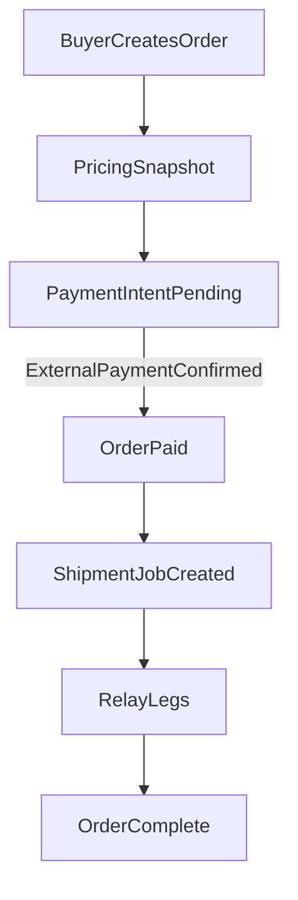

# Jarmenke Backend Implementation Plan

## Goals

- Extend existing market and logistics modules to support Jarmenke rules: tiered wholesale pricing, 3% + 3% commissions, fair overrides, fraud signals, and clear state ownership.
- Keep payments external (Kaspi/QR) and model only payment intent/status.
- Maintain modular architecture and transactional integrity.

## Scope and Decisions

- Backend-only changes.
- External payments: add payment intent/status records but no wallet or escrow.
- Tiered wholesale pricing: store tiers and compute final unit price by quantity.

## Key Existing Modules to Extend

- Market module: [qunarly-backend/src/market/market.service.ts](/Users/ulagatsametai/Documents/Qunarly/qunarly-backend/src/market/market.service.ts)
- Prisma schema: [qunarly-backend/prisma/schema.prisma](/Users/ulagatsametai/Documents/Qunarly/qunarly-backend/prisma/schema.prisma)
- Logistics/Shipment: [qunarly-backend/src/logistics/logistics.service.ts](/Users/ulagatsametai/Documents/Qunarly/qunarly-backend/src/logistics/logistics.service.ts)
- Orders: [qunarly-backend/src/orders/orders.service.ts](/Users/ulagatsametai/Documents/Qunarly/qunarly-backend/src/orders/orders.service.ts)

## State Ownership

- `Order` owns commerce state: `CREATED`, `PAYMENT_PENDING`, `PAID`, `CANCELED`, `COMPLETED`.
- `ShipmentJob` owns logistics state: `ASSIGNED`, `PICKED_UP`, `IN_TRANSIT`, `DELIVERED`, `FAILED`.
- `Order` becomes `COMPLETED` only when its `ShipmentJob` is `DELIVERED`.
- Do not copy shipment state into `Order` beyond linkage.

## Data Model Changes (Prisma)

- Required models:
  - `ProductPriceTier(minQty, maxQty?, unitPrice, currency, productListingId)`.
  - `OrderItem(appliedTierId?, unitPriceSnapshot, qtySnapshot)` plus `orderId`, `productListingId`.
  - `PaymentIntent(provider, amount, currency, status, externalRef, idempotencyKey)`.
  - `CommissionRecord(orderId, productRateApplied, deliveryRateApplied, productCommissionAmount, deliveryCommissionAmount, source)`.
  - `JarmenkeEvent(startAt, endAt, productRateOverridePercent?, deliveryRateOverridePercent?)`.
  - `FraudSignal(type, metaJson, status, ipHash?, userId?, orderId?)`.
- Extend `Order` to store totals snapshot (product subtotal, delivery fee, commissions, final total).
- Extend `ProductListing` to reference tiers and support reserved quantity.

## Business Logic and Services

- Tiered wholesale price resolver:
  - Select tier with highest `minQty` where `qty >= minQty` and `maxQty` is null or `qty <= maxQty`.
  - If no tier matches, fallback to retail `ProductListing.price`.
  - Snapshot `appliedTierId` and `unitPriceSnapshot` on `OrderItem`.
- Commission calculation service:
  - `productCommission = productSubtotal * productRateApplied`.
  - `deliveryCommission = deliveryFee * deliveryRateApplied`.
  - Snapshot rates at order creation; do not change later if event starts/ends.
- Order flow updates:
  - Create order with totals snapshot and `PaymentIntent(PENDING)`.
  - On payment confirmation (manual or webhook), create `ShipmentJob` exactly once.
- Shipment job creation:
  - Reuse relay delivery model already present; ensure order->shipment linkage is maintained.

## API Changes (Controllers + DTOs)

- Product endpoints:
  - Create/update listing with `tiers[]`.
  - Listing preview accepts `qty` and returns computed `unitPrice`.
- Order endpoints:
  - Create order with items, delivery fee/option.
  - Confirm payment (manual admin endpoint) and optional webhook handler.
- Admin endpoints:
  - Create Jarmenke event.
  - Analytics: turnover, commissions, active sellers/drivers.

## Fraud and Rating Hooks

- Fraud checks:
  - Add simple server-side counters for multiple orders by IP and cancel thresholds.
  - Create `FraudSignal` records for manual review.
- Ratings:
  - Store rating aggregates on user profile; add endpoints to submit ratings after completion.

## Transactional Integrity and Concurrency

- Order create must be a single transaction:
  - Reserve stock (increment `reservedQty` or separate reservation table).
  - Create `Order` and `OrderItem` snapshots.
  - Create `CommissionRecord`.
  - Create `PaymentIntent(PENDING)`.
- On payment failure/cancel, rollback reservation (`reservedQty` decrement).
- Payment confirm must be idempotent by `externalRef` and `idempotencyKey` to avoid duplicate shipment jobs.

## Observability and Consistency

- Ensure all state transitions are transactional.
- Use notifications for pricing changes and order status updates.

## Mermaid: Order and Shipment Flow

## Implementation Steps

- Update Prisma schema and generate migrations.
- Add tier selection + commission calculation services with tests.
- Extend market/order services with snapshot logic and reservations.
- Add payment confirmation endpoints (manual and webhook handler).
- Link `Order -> ShipmentJob` without altering logistics module internals.

## Testing Plan

- Unit tests: tier selection, commission calculations, order totals.
- Integration tests: order creation -> payment confirm (idempotent) -> shipment job creation.
- Concurrency tests: reservation behavior under parallel orders.

## Open Questions

- None blocking. Implement based on external payments and tiered pricing choice.

