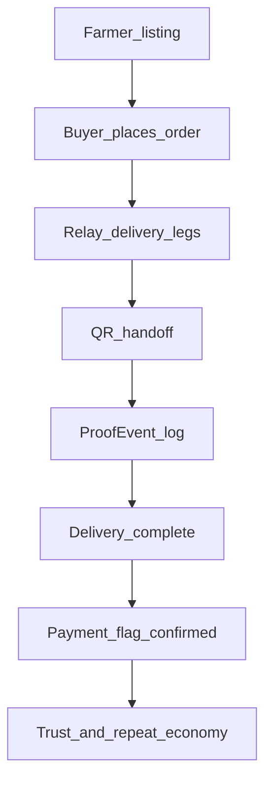

# QUNARLY — ARCHITECTURE CANON (Single Source of Truth)

Qunarly — ауыл мен қаланы біріктіретін тірі экономикалық жүйе.

Бұл файл реподағы архитектура, ағын, шешімдер және операциялық ережелердің жалғыз ресми көзі. Core кодқа әсер ететін кез келген өзгеріс осы файлмен бірге жаңартылуы міндетті.

---

## Vision

Qunarly — жай маркетплейс емес; ол қозғалысқа негізделген экономика: ауылда өнім бар, қалада сұраныс бар, ал Qunarly осы екеуін артық делдалсыз, түсінікті цифрлық ағынмен қосады.

---

## Core Flows

Qunarly үш бөлек сервис емес. Бір тірі ағын:

**Шаруа → Тапсырыс → Тасымал → Тарату → Ақша → Сенім**

### Бір ағынның техникадағы көрінісі

`Listing → Order → DeliveryRequest → DeliveryLeg → Handoff/ProofEvent → Complete → PaymentConfirmed`

### Mermaid

---

## Product Pillars (Бір ағын ішіндегі 3 тірек)

### 1) Järmeñke — Сату
- Шаруа 1 минутта тауар қоса алуы керек.
- Минимал интерфейс:
  - Фото
  - Атауы
  - Бағасы
  - Салмағы/көлемі
  - "Қосу"
- Сатып алушы үшін:
  - Іздеу
  - Фильтр (жақын, бүгін жеткізіледі, бағасы)
  - Тапсырыс батырмасы
- Бастапқы бизнес принципі:
  - Төмен комиссия (2–4%, ауыл сенімін сақтау).

#### Järmeñke UX принциптері (қатаң)
- Фермер интерфейсінде артық өріс болмайды.
- Категория қателессе, алғашқы кезеңде блок емес (кейін AI/авто-түзету қабаты қосылады).
- Сатып алушыға "тауарды табу" жылдамдығы "көркем UI"-дан маңызды.
- Қала қолданушысы "ауылдан тікелей" және "бүгін жеткізіледі" сигналын бір қарағанда көруі керек.

#### Järmeñke acceptance (product)
- Farmer listing жасау уақыты: 1 минутқа дейін.
- Listing жарияланғаннан кейін market feed-те көрінуі: бірден.
- Buyer order submit алдында баға құрылымы түсінікті көрінуі керек (тауар + жеткізу).

### 2) Tasymal — Эстафеталық тасымал
- Qunarly-дің жүрегі.
- Принцип:
  - Склад емес
  - Қозғалыс
  - Бос қайтпау экономикасы
- Эстафета:
  1. Ауыл → Аудан
  2. Аудан → Қала
  3. Қала ішкі тарату
- Әр кезең = `DeliveryLeg`
- Handoff:
  - QR/token
  - беру/қабылдау
  - ProofEvent арқылы кім жауапты екенін бекіту

### 3) Taxi — Ауыл ішкі қозғалыс
- Uber емес, ауыл кезегін цифрландыру.
- Принцип:
  - Карта/күрделі маршрут негізгі емес
  - FIFO кезек
  - Түсінікті тізім және статус
- Жүргізуші көреді:
  - Орны
  - Статусы
  - Сәлемдеме/жолаушы саны
- Жолаушы көреді:
  - Қай көлік келеді
  - Шамамен күту уақыты

---

## Domain Map (UI ↔ API ↔ DB)

### Auth / Identity
- UI: `qunarly-mobile/app/(auth)/*`, `qunarly-admin-web` login
- API: `/auth/*`
- DB: `User`, `Profile`, `RefreshToken`

### Järmeñke (Listings/Offers/Deals)
- UI: `qunarly-mobile/app/(tabs)/market/*`
- API: `/market/listings*`, `/market/offers*`, `/market/deals*`
- DB: `ProductListing`, `ListingImage`, `Offer`, `Deal`, `File`

Canonical mini-flow:
1. `POST /market/listings` (farmer)
2. `GET /market/listings` (buyer feed/search/filter)
3. `POST /market/listings/:id/offers` немесе бірден `POST /orders`
4. `POST /market/offers/:id/accept` → `Deal` (келісімді маршрут)

### Orders + Tasymal Flow
- UI: `qunarly-mobile/app/(tabs)/market/details/[id].tsx`, `app/(tabs)/logistics/*`
- API: `/orders/*`, `/delivery/*`, `/payments/confirm`
- DB:
  - `Order`
  - `DeliveryRequest`
  - `Delivery`
  - `DeliveryLeg`
  - `HandoffToken`
  - `ProofEvent`

### Taxi / Trips
- UI: `qunarly-mobile/app/taxi/*`, `app/trips/*`
- API: `/taxi/*`, `/trips/*`, `/routes/*`, `/presence/*`
- DB: `TaxiRoute`, `DriverQueue`, `RideRequest`, `DriverOffer`, `TripSession`, `TripBooking`, `Hub`

### Admin / Trust / Ops
- UI: `qunarly-admin-web/app/admin/*`
- API: `/admin/*` (write операцияларында reason + audit)
- DB: `AuditLog`, `OrderDispute`, `RefundFlag`, `CommissionConfig`, `RateLimitPolicy`, `AccessListEntry`, `AlertConfig`

---

## Services / Apps

### `qunarly-backend/`
- NestJS API, бизнес логика, транзакциялар, proof/audit, queue/relay ережелері.

### `qunarly-mobile/`
- Farmer/Buyer/Carrier күнделікті UX (listing, order, delivery, handoff, taxi queue).

### `qunarly-admin-web/`
- Операциялық бақылау: orders, stuck, users, audit, dispute/тәуекел бақылауы.

---

## DB Core (Prisma Core Graph)

- Identity: `User` ↔ `Profile`
- Commerce: `ProductListing` → `Offer`/`Deal` → `Order`
- Delivery: `Order` → `DeliveryRequest` → `DeliveryLeg[]` → `HandoffToken` + `ProofEvent`
- Taxi: `TaxiRoute` ↔ `DriverQueue` ↔ `RideRequest` ↔ `TripSession`/`TripBooking`
- Trust/Ops: `AuditLog`, `OrderDispute`, `RefundFlag`, `Commission*`

### Marketplace core байланысы (нақты)
- `User(FARMER)` 1:N `ProductListing`
- `ProductListing` 1:N `ListingImage`
- `ProductListing` 1:N `Offer`
- `Offer` N:1 `User(BUYER)`
- `Offer(ACCEPTED)` → `Deal`
- `Deal/Listing` → `Order`
- `Order` кейін `DeliveryRequest/DeliveryLeg` ағынына өтеді

---

## API Modules (Nest)

Негізгі модульдер (`qunarly-backend/src/app.module.ts`):
- `auth`
- `users`, `profiles`
- `market`
- `orders`
- `delivery`
- `logistics`
- `taxi`, `trips`
- `hubs`, `routes`, `presence`
- `payments`
- `notifications`
- `admin`
- `health`, `debug`

---

## Runtime (Local)

### Backend
1. `cd qunarly-backend`
2. `npm ci`
3. `npx prisma migrate dev` (немесе deploy)
4. `npm run start:dev`

Env минимум:
- `DATABASE_URL`
- `JWT_SECRET`
- `JWT_REFRESH_SECRET`
- `PORT`

### Mobile (Expo Go)
1. `cd qunarly-mobile`
2. `CI=0 npx expo start -c --lan`

Env минимум:
- `EXPO_PUBLIC_API_BASE_URL` (немесе HOST/PORT)
- `EXPO_PUBLIC_GOOGLE_MAPS_API_KEY`

### Admin Web
1. `cd qunarly-admin-web`
2. `npm i`
3. `NEXT_PUBLIC_API_BASE_URL=http://localhost:3000 npm run dev`

---

## CI / Workflows

Қазіргі workflows:
- `.github/workflows/load-test.yml` — k6 smoke load test, Postgres services, migrate/seed/start/run.
- `.github/workflows/architecture-canon-check.yml` — core path өзгерсе canon update-ты блоктайды.
- `.github/workflows/canonical-flow-e2e.yml` — canonical "тірі ағын" E2E сценарийін PR-де тексереді.

---

## Canonical Acceptance Flow (Definition of "Project is alive")

Міндетті сценарий:
1. Шаруа тауар қосты
2. Қаладағы адам тапсырыс берді
3. Ауыл көлігі алды
4. Аудан көлігіне берді (handoff)
5. Қалаға жетті
6. Таралды/жеткізу аяқталды
7. Ақша `CONFIRMED` белгісімен бекітілді

Ескерту: ақша аппта сақталмайды; тек статус/растау флагы жүргізіледі.

Marketplace-only gate:
1. Farmer listing қосты
2. Buyer listing-ті тапты (search/filter)
3. Buyer order берді
4. Order статусы тасымал ағынына өтті

---

## Reality vs Target

### Қазір бар (Implemented now)
- Marketplace module бар
- Orders бар
- Delivery leg/handoff/proof бар
- Taxi queue/trips бар
- Admin audit бар

### Мақсатты бекіту (Target to lock)
- Жоғарыдағы толық ағын бір E2E сценарийде тұрақты өтсін.
- Осы тест өтпесе: "код бар, бірақ жүйе толық тірі емес".

### Marketplace Reality vs Target

Қазір бар:
- Listing/Offer/Deal/Order backend деңгейінде бар.
- Mobile market экрандары бар (`index`, `details`, `create`, `my-listings`, `inbox`, `deals`).

Жақын мақсат:
- "Бүгін жеткізіледі", "Ауылдан тікелей", "Ең жақын" фильтрлерін product сигнал ретінде тұрақтандыру.
- Фермер listing UX-ын тек 5 негізгі әрекетке шектеу.
- Market conversion funnel өлшемдерін бекіту (listing created → viewed → ordered).

---

## Decisions Log (ADR mini)

Формат: `[YYYY-MM-DD] Шешім — Себебі — Салдары`

- `[2026-02-27] Бір ағын моделі бекітілді` — Продуктті "3 сервис" деп бөлу UX/ops-ты қиындатады — Canon бір pipeline тіліне көшті.
- `[2026-02-27] ProofEvent append-only` — Даулы жағдайды қайта құру үшін өзгермейтін timeline керек — Өткен оқиға түзетілмейді, тек жаңа оқиға қосылады.
- `[2026-02-27] Canon change mandatory in PR` — Архитектура құжаты ескірмеуі керек — Core код өзгерсе canon update міндетті.
- `[2026-02-27] One full flow = project alive` — Жүйе ағын ретінде дәлелденуі керек — Canonical E2E test міндетті бекіту нүктесі болды.
- `[2026-02-27] Marketplace minimalism first` — Фермер үшін енгізу шегі неғұрлым төмен болу керек — Järmeñke UX тек негізгі өрістермен шектелді.

---

## Changelog

Формат: `[YYYY-MM-DD] не өзгерді (файл/модуль)`

- `[2026-02-27]` Canon "бір ағын" философиясымен толық қайта жазылды: Järmeñke + Tasymal + Taxi.
- `[2026-02-27]` Definition-of-done ретінде canonical acceptance flow енгізілді.
- `[2026-02-27]` `qunarly-backend/test/e2e/canonical-flow.e2e-spec.ts` қосылды.
- `[2026-02-27]` `.github/workflows/canonical-flow-e2e.yml` қосылды.
- `[2026-02-27]` Marketplace бөлімі тереңдетілді (UX принциптері, acceptance, reality-vs-target, DB байланыс).

---

## Governance (Non-negotiable)

### Canon Update Rule

Репода feature/DB/API/UI өзгерсе, сол PR ішінде `docs/ARCHITECTURE_CANON.md` жаңартылуы міндетті.

**Қағида: Код өзгерді → Canon да өзгерді.**
